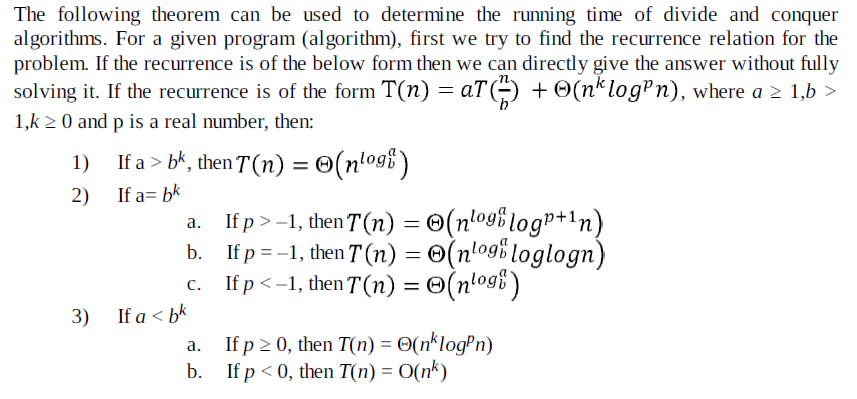

## OOP
	
## Runtime Polymorphism

- [Dynamic Binding - (virtual functions)](https://www.geeksforgeeks.org/virtual-functions-and-runtime-polymorphism-in-c-set-1-introduction/)

- If we define a virtual function in the base class, with another version in a derived class, it will **signal the compiler that we don’t want static linkage for this function**.
- If we use virtual functions the compiler looks at the **contents of the pointer (dynamic binding) rather than its type**.
	
- __Application of Runtime Polymorphism or Dynamic Binding__:

		Let the code has a simple base class Employee , the class contains virtual functions like raiseSalary(), transfer(), promote(), etc. 		    Different types of employees like Manager, Engineer, etc. may have their own implementations of the virtual functions present in base 			class Employee. 
		In our complete software, we just need to pass a list of employees everywhere and call appropriate functions without even knowing the 			type of employee. For example, we can easily raise the salary of all employees by iterating through the list of employees. Every type of 			employee may have its own logic in its class, but we don’t need to worry about them because if raiseSalary() is present for a specific 			employee type, only that function would be called.

	
	
## Pointers

```
	int x = 10;
	cout<<&10;	// works
	
	char ch = 'a';
	cout<<&ch;	// print 'a' only not the address 
	// because `cout<<` just print the value not the address of char type   
```
To avoid this:
```
cout<<(void *) &ch;	// using explicit type cast
// now `cout<<` don't know the real type of `ch`
```

- Array pointer
```
int a[10];
int *p;

p = a;	// legal
a = p;	// illegal

//also
p++;	// legal
a++;	// illegal
```


## Algorithm Analysis

### Basic time and space complexity analysis:

*  - We use **Big O** notation to show **worst case** complexity.
   - **Omega(&omega;)** for **best time** complexity
   - **Theta (&theta;)** when both worst and best time complexity **are equal**.
*  An algorithm with k-nested loops of about n iterations each has $O(n^k)$ complexity
*  If your algorithm is recursive with b recursive calls per level and has L levels, the algorithm has roughly $O(b^L)$ complexity, but this is a only a rough upper bound. The actual complexity depends on what actions are done per level and whether pruning is possible. 
*  A Dynamic Programming algorithm or other iterative routine which processes a 2D n×n matrix in $O(k)$ per cell runs in $O(k ×n^2)$ time.

- $`c`$ ≪ $`loglogn`$ ≪ $log^an$ ≪ $n$ << $nlogn$ << $n^b$ ≪ $c^n$ ≪ $n!$ ≪ $n^n$     [n→∞, and fixed a>0,b>1,c>1 and any real d]
- https://www.khanacademy.org/computing/computer-science/algorithms/asymptotic-notation/e/quiz--asymptotic-notation


* **Master Theorem:** 



### Familiarity with these bounds: 

* 2^{10} = 1024 ≈ 10^3 <br/>
  2^{20} = 1,048,576 ≈ 10^6

* **32-bit signed integers (int)** and **64-bit signed integers (long long)** have upper limits of $2^{31}−1 ≈ 2×10^9$ (safe for up to \approx 9 decimal digits) and 2^{63}−1 = 9×10^{18} (safe for up to \approx 18 decimal digits) respectively. 

*  **Unsigned integers** can be used if only **non-negative** numbers are required. **32-bit unsigned integers (unsigned int) and 64-bit unsigned integers (unsigned long long)** have upper limits of $2^{32}−1 ≈4×10^9$ and $2^{64}−1 \approx 1.8×10^{19}$ respectively

* $1M = 10^6$


### Array

* deallocate dynamic array using -> `delete[]` operator, Its call destructor for every object(element) of array. 

### Linked List

* Arrays are faster to read but linked lists are **faster to write in between**.
  > In arrays, If we want to insert or delete an element in between the array we have to shift all the following elements accordingly.
  But in case of linked list we just need to move some pointers and thats it.


### Heap

* Complete binary trees (CBT).
  > All levels are complete except for the last level.
    Last level can be complete or partially complete **filled from left to right.**

* STL:
	> Priority queue of integers
	- priority_queue<int> pq; 							 (max heap by default)
	- priority_queue<int, vector<int>, greater<int>> pq; (min heap by using **inbuilt** keyword `greater`)
	- ```
		class Comparator {
			public:
				// `()` operator overloading
				bool operator()(int a, int b) {
					// max heap
					return a < b;
				}
		};
		
		comparator c;
		c();	
		// will invoke overloaded function
		// that is how object `c` is behaving like function
	  ```
	
	  priority_queue<int, vector<int>, Comparator>		(min heap by using **custom** comparator called **functors**-Objects behaving like objects)
	  
	  
	
### Bitwise Techniques

* **bitset**<4> num=4

*  To **multiply/divide** an integer by 2 (or any power of 2), we only need to **shift the bits** in the integer left/right, respectively.

* To check if the $j^(th)$ item of the number is on, use the bitwise AND operation **T = S & (1<< j).**

*  To **clear** $j^(th)$ bit use **S &=∼(1 << j)**

* To **toggle** $j^(th)$ bit use **XOR** as **S ^= (1 << j)*** 

* To get the value of the  **least significant bit** that is on (first from the right), use **T = (S & (-S)**

* ~N = -(N-1)

* Number of set bits:<br/> 
    * `while(n>0) n&=(n-1)`, **Time Complexity: O(no. of set bits)**
    * `__builtin_popcount(n)`

* find **rightmost set** bit: 
	1) set_bit = x & ~(x-1) 
	2) set_bit = (x & (x-1))^x	(using above point concept (Number of set bits))
	
## Modular Arithmatic

* Addition: (a+b)%m = ((a%m) + (b%m))%m
* Substraction: (a-b)%m = ((a%m) - (b%m) + m)%m
* Multiplication: (a*b)%m = ((a%m) * (b%m))%m

* **Division:** <br>
> **Fermat’s little theorem**: a^{-1}=a^{m-2}%m
> https://www.programmersarmy.com/modular2.html

**Division: (a/b)%m = (a*power(a,m-2))%m = ((a%m) * (x%m))%m**

## Recursion

* Recursion function also takes **stack space** for recursive function calling 
### Backtracking

* Backtracking is a sort of refined brute force.
* Backtracking speeds the exhaustive search by **pruning**.
* Soometimes, best algorithm for a problem is to try all possibilities

## Dynamic Programming

- Identification: 
    - Choices (It means recursive)
    - Optimal Substructure (max, min largest,etc.)

- Approach: Recursive (Use choice diagram) -> Memoisation -> Bottom Up


